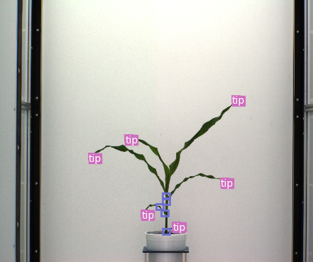

# Deep Learning for Plant Keypoint Detection

This repository contains scripts and results for using YOLOv3 object 
detection model to detect tips and open collars in maize plants. Tips 
and open collars can inform scientist and farmers about the age and 
health of the plant. It can also aid in extracting other useful 
information from the images such as leaf length and internode length. 

First, follow the instructions to clone the 
[YOLOv3](https://github.com/eriklindernoren/PyTorch-YOLOv3.git) 
repository which also includes pretrained models. We used a pretrained 
backbone and fine tuned the model on the maize dataset.

The dataset used to train and test the model can be found 
[here](https://plantvision.unl.edu/dataset-unl-cppd).

We utilized google collab for this project so that we could keep the data
on the cloud. The prepare_data collab notebook runs the user through
processing the data. Update paths to match directory structure. The notebook
run_yolo enables interactive training and testing of the model as well 
as generating labeled images. 

Here are some of the output photos we got during the test run:

 
 

Clearly the model does a good job of finding most keypoints, however you can
see that there are quite a few false detections. This is reflected in our 
test metrics curves below.

Training seems to be going well:

 

Testing gave decent results. However, as we could see in the output images, the recall
is high but precision is lower resulting in a lower total mAP and F1 score:

 

